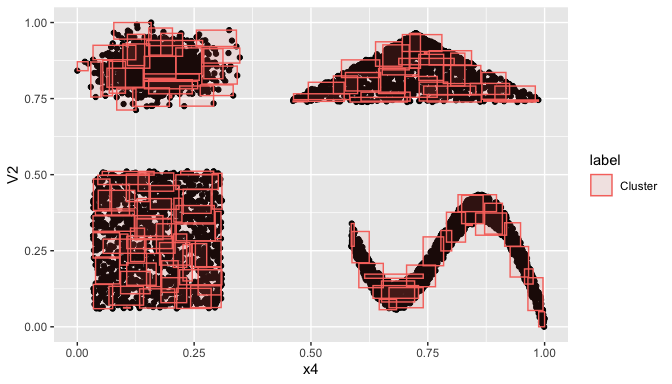
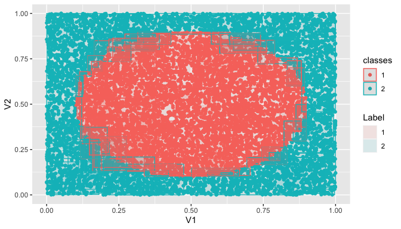
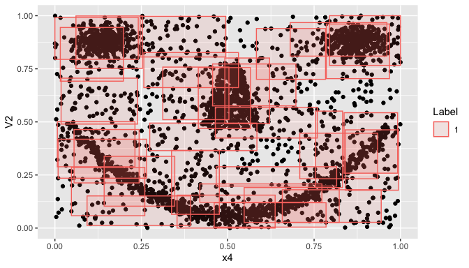
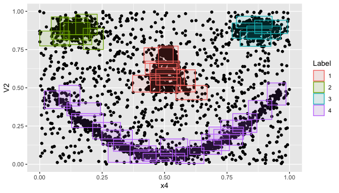

## ART is now available in R!

rART is a package containing the implementations of various ART
(Adaptive Resonance Theory) models. ART is a class of neural network
model that can perform both unsupervised and supervised (called ARTMAP)
clustering online. The package is mainly written in Rcpp.

## What is Adaptive Resonance Theory?

Adaptive Resonance Theory (ART) is a neural network model developed by
Stephen Grossberg. It is a neuro-cognitive model that attempts to
explain how the brain learns and interacts with the stimuli in the
environment. The main ART model consists of a winner-take-all system,
with the ability to dynamically generate additional categories for
capturing different patterns in the data<sup>4</sup>. These two
properties help solve the stability-plasticity problem that plagues most
machine learning algorithms: how to learn new patterns without erasing
the learned memories.

ART also shows several advantages over other machine learning models.
These include:

1.  online learning,
2.  fast learning,
3.  explanable.

For a comprehensive review of ART and its variants, please read da Silva
et al., 2019 <sup>4</sup>.

## The rART package

The rART package currently provides the implementation of two types of
ART architecture: the standard ART and topology-learning ART (TopoART).
TopoART forms linkages between clusters to enable the learning of the
topology from the data. Additionally, TopoART possesses a noise
filtering mechanism that prevents overfitting.

Currently, rART provides the fuzzy and hypersphere learning rules for
both the standard and the topological versions. In the future, other
learning rules and architectures will be added.

## Installation

rART is not available on CRAN yet, but you can install the latest
development version:

``` r
remotes::install_github("alersh/rART")
```

## Usage

### ART

ART is an unsupervised learning model and its object can be instantiated
using the function ART(). Two learning rules are available: fuzzy and
hypersphere. If the fuzzy rule is chosen, then all data must be
normalized between 0 and 1<sup>3</sup>. Additionally, the complement of
each data point d, which is 1 - d, must be created. Thus, if the dataset
has a dimension of n, then the dimension of the actual input to the
Fuzzy ART network is n x 2. Users are required to normalize the data
prior to training and testing the data. Complement coding is taken care
of by rART internally. The combination of the fuzzy rule and complement
coding create hyperrectangular categories.

The Fuzzy ART network has two hyperparameters: Learning rate (*β*) and
vigilance (*ρ*)<sup>3</sup>. The learning rate *β* must be between 0 and
1. Fast learning (*β* = 1) can be achieved and is normally set as the
default. The vigilance parameter *ρ* decides whether an input pattern
closely matches with the weight pattern of the selected category. The
value must be between 0 and 1. A smaller value provides more
generalization.

Here is an example of using Fuzzy ART to cluster different shapes:

``` r
trainShapes <- mlbench.shapes(n = 5000)
trainShapes$x <- normalize(trainShapes$x)
art <- ART(rule = "fuzzy", dimension = 2, vigilance = 0.93) # create an ART object
train(art, as.matrix(trainShapes$x)) 
plot(art, id = 0, .data = trainShapes$x) # plot the data and the weights.
```

<!-- -->

### ARTMAP

ARTMAP is the supervised learning model<sup>2</sup>. rART provides both
the standard and simplified versions of ARTMAP. For the summary
descriptions on the standard and simplified ARTMAP, please see da Silva
et al.<sup>4</sup>. For most classification problems, users should
choose the simplified method as it is faster and uses less memory. The
standard method is generally used for regression.

Here is a circle-in-a-square classification problem solved with the
simplified Fuzzy ARTMAP:

``` r
# circle in a square
trainCirSquare <- mlbench.circle(n = 10000)
testCirSquare <- mlbench.circle(n = 1000)
artmap <- ARTMAP(rule = "fuzzy", dimension = 2, vigilance = 0.8)
train(artmap, trainCirSquare$x, trainCirSquare$classes)
plot(artmap, .data = trainCirSquare$x, classes = trainCirSquare$classes) # create the 2 dimensional plot of the data and the weights
```

<!-- -->

``` r
p <- predict(artmap, .data = testCirSquare$x, simpleTargets = testCirSquare$classes)
sum(p$matched)/length(p$matched) * 100 # percent correct
#> [1] 98.2
```

The user can also implement the standard fuzzy ARTMAP<sup>2</sup>. In
this case, the user must first convert the class labels into dummy
(binary) codes. rART provides two functions that aid the conversion. The
createDummyCodeMap() takes the unique target labels and convert them to
dummy codes. The function encodeLabel() converts all the target labels
into dummy codes using this dummy code map.

``` r
# circle in a square
trainCirSquare <- mlbench.circle(n = 10000)
testCirSquare <- mlbench.circle(n = 1000)
artmap <- ARTMAP(rule = "fuzzy", dimension = 2, vigilance = 0.9, simplified = FALSE)
dummyMap <- createDummyCodeMap(unique(trainCirSquare$classes))
trainCirSquare$dummyClasses <- encodeLabel(trainCirSquare$classes, dummyMap)
testCirSquare$dummyClasses <- encodeLabel(testCirSquare$classes, dummyMap)
train(artmap, trainCirSquare$x, standardTargets = trainCirSquare$dummyClasses)
plot(artmap, .data = trainCirSquare$x, classes = trainCirSquare$dummyClasses, dummyCodeMap = dummyMap) # create the 2 dimensional plot of the data and the weights
```

<!-- -->

``` r
p <- predict(artmap, .data = testCirSquare$x, standardTargets = testCirSquare$dummyClasses)
sum(p$matched, na.rm = T)/length(p$matched) * 100 # percent correct
#> [1] 97.5
```

The standard ARTMAP is better suited for regression
problems<sup>2</sup>. Below is an example that uses the standard Fuzzy
ARTMAP to approximate a sinusoidal function:

``` r
x = seq(0, 1, by = 0.001)
y <- (sin(2*pi*x))^2
fn <- cbind(x = x, y = y) # function to be approximated
s <- sample(nrow(fn)) # randomize rows
s_train <- fn[s,]
a <- ARTMAP(dimension = 1, simplified = FALSE)
a$module$b$rho <- 0.95 # The degree of approximation is determined by the vigilance parameter in ART b.
train(a, as.matrix(s_train[,1]), standardTargets = as.matrix(s_train[,2]))
# get the fit
result <- predict(a, as.matrix(s_train[,1])) 
z <- cbind(s_train[,1], result$predicted)
ggplot(data.frame(x = z[,1],y = z[,2])) + geom_line(aes(x = x, y = y), color = "red") +
  geom_line(data = data.frame(x = s_train[,1], y = s_train[,2]), aes(x = x,y = y))
```

<!-- -->

### Fuzzy TopoART

TopoART stands for “Topology-learning ART”. It can learn the topology
from the data by linking clusters together<sup>5</sup>. A TopoART
network consists of two ART modules in series. Within each module, every
learned category possesses a counter that counts the number of samples
encoded by that category. A hyperparameter *ϕ* determines the minimum
number of sample required for a category to become permanent. Every *τ*
learning cycle, those categories containing samples fewer than *ϕ* will
be removed. In the first module, those samples that belong to the
permanent categories will be retained and advanced to the second module
where they will be further classified into finer categories. Thus, the
second module learns a subset of the data that are filtered by the first
module.

The learning of the topology can be done in both TopoART modules. During
learning, once the best matching category is found, the second best
matching category will be searched. If this second best mathcing
category is found, then a link is created between this category and the
best matching category. The learning rate for the second best matching
category will be smaller than that for the best matching category.

Here is an example of using TopoART to cluster a noisy smiley face.
Notice the smaller category size in module 2 when comparing it to the
size in module 1. The user can specify which module to plot by entering
the id number (0 for the first module and 1 for the second module).

``` r
# smiley face
data(noisySmiley)
topoart <- TopoART(rule = "fuzzy", dimension = 2, vigilance = 0.88, tau = 200, phi = 5)
train(topoart, noisySmiley)
plot(topoart, id = 0, noisySmiley) # the ART a module
```

<!-- -->

``` r
plot(topoart, id = 1, noisySmiley) # the ART b module
```

<!-- -->

### Hypersphere ART

In all of the above examples, the user can substitute the fuzzy rule
with the hypersphere rule<sup>1</sup>. The advantages of using the
hypersphere rule are: 1) it does not require complement coding, and 2)
it does not require normalization<sup>1</sup>.

## Final Words

I hope you will find this package useful. If you discover any problem,
please contact me at <alersh@gmail.com> and provide me with the details
of the problem.

## References

1.  Anagnostopoulos, GC, Georgiopoulos, M. (2000) “Hypersphere ART and
    ARTMAP unsupervised and supervised, incremental learning”,
    Proceedings of the IEEE-INNS-ENNS International Joint Conference on
    Neural Networks. Neural Computing: New Challenges and Perspectives
    for the New Millennium, 6.

2.  Carpenter, GA, Grossberg, S, Markuzon, N, Reynolds, JH, Rosen,
    DB. (1992) “Fuzzy ARTMAP: A neural network architecture for
    incremental supervised learning of analog multidimensional maps”,
    IEEE Transactions on Neural Networks, 3(5), pp. 698-713.

3.  Carpenter, GA, Grossberg, S, Rosen DB. (1991) “Fuzzy ART: Fast
    stable learning and categorization of analog patterns by an adaptive
    resonance system”, Neural Networks, 4(6), pp 759-771.

4.  da Silva, L.E.B, Elnabarawy, I., and Wunsch II, D.C. (2019) “A
    survey of Adaptive Resonance Theory neural network models for
    engineering applications”, Neural Networks, 120, pp 167 - 203.

5.  Tscherepanow, M. (2010) “TopoART: A topology learning hierarchical
    ART network”, Proceedings of the International Conference on
    Artificial Neural Networks (ICANN). LNCS, 6354, pp. 157–167.
